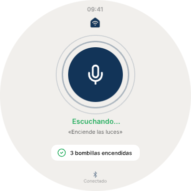

# Prototipo de Smart Home — Wear OS

Prototipo visual de la aplicación Smart Home para smartwatches con Wear OS. Comparte la misma paleta de colores que la aplicación principal (tonos beige y azul marino) y está diseñado para una pantalla circular de 384x384 píxeles.

---

## Pantalla Principal

Interfaz mínima diseñada exclusivamente para el control por voz de los dispositivos del hogar, sin controles táctiles para actuar sobre dispositivos individuales. En la parte superior se muestra la hora y el nombre de la aplicación. El elemento central es un botón de micrófono de gran tamaño rodeado por dos anillos concéntricos que indican visualmente el estado de escucha activa. Al pulsar el botón, el reloj comienza a capturar audio y lo envía a la aplicación principal del teléfono, que se encarga del reconocimiento de voz (speech-to-text) y de ejecutar la acción correspondiente sobre los dispositivos.

Debajo del micrófono se muestra el estado actual del sistema ("Escuchando...") y el comando reconocido por el motor de voz. Una tarjeta de confirmación presenta el resultado de la acción ejecutada, indicando con un icono de verificación qué dispositivos se han visto afectados. En la parte inferior, un indicador de conexión Bluetooth confirma el enlace activo con la aplicación principal del teléfono, imprescindible para el funcionamiento del módulo.
