# Prototipo de Smart Home

Prototipo visual de alta fidelidad de la aplicación Smart Home, diseñado con una paleta de colores cálida basada en tonos beige y azul marino. A continuación se presenta cada pantalla del prototipo junto con una descripción de sus funcionalidades.

---

## Splash

Pantalla de carga inicial que muestra el logotipo de Smart Home sobre un fondo beige claro. Es la primera pantalla que ve el usuario al abrir la aplicación, y se muestra brevemente mientras se inicializan los servicios y la conexión con los dispositivos del hogar.

---

## Dashboard

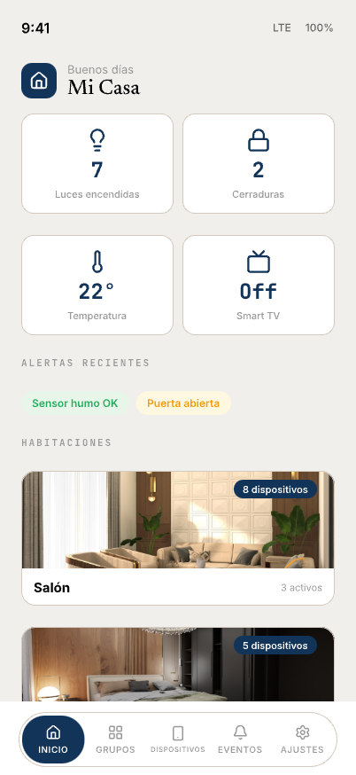

Pantalla principal de la aplicación que ofrece una vista general del estado de la casa. En la parte superior muestra un saludo personalizado y cuatro tarjetas de resumen con el número de luces encendidas, cerraduras activas, temperatura actual y estado de la Smart TV. Debajo, una sección de alertas recientes muestra notificaciones relevantes como el estado del sensor de humo o avisos de puerta abierta. La parte inferior presenta las habitaciones del hogar con fotografías reales de cada estancia, indicando el número total de dispositivos y cuántos están activos en ese momento.

---

## Habitaciones

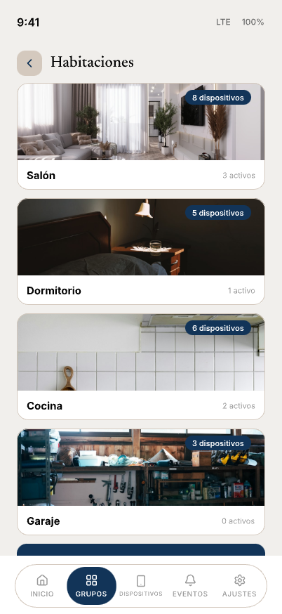

Vista completa de los grupos lógicos de la casa organizados por estancias: Salón, Dormitorio, Cocina y Garaje. Cada habitación se presenta como una tarjeta con la fotografía de la estancia, su nombre, el número de dispositivos asignados y cuántos están activos. Al pulsar sobre una habitación se accede a la vista detallada de sus dispositivos, permitiendo controlarlos individualmente o ejecutar acciones conjuntas sobre todos los dispositivos de esa estancia.

---

## Editar Grupo

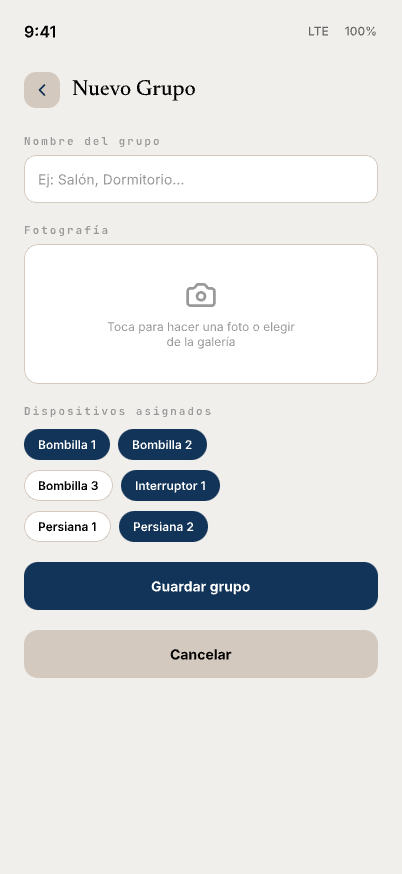

Formulario para crear o editar un grupo lógico de dispositivos. Permite asignar un nombre descriptivo a la estancia, añadir una fotografía representativa (tomada con la cámara del dispositivo o seleccionada de la galería) y seleccionar qué dispositivos pertenecen al grupo mediante chips interactivos. Los botones inferiores permiten guardar los cambios o cancelar la operación.

---

## Dispositivos

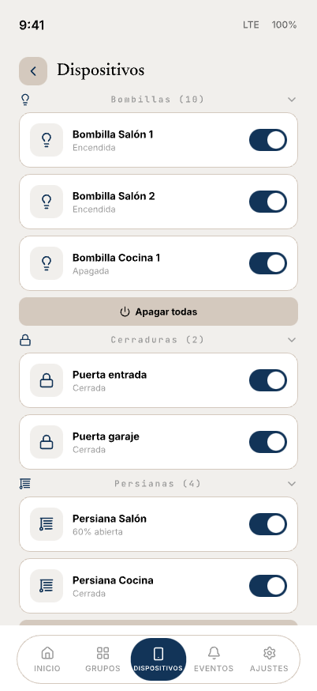

Lista unificada de todos los dispositivos de la casa agrupados por tipo. Muestra secciones para bombillas (10), cerraduras (2), persianas (4), interruptores (5), sensores, termostato y Smart TV. Cada dispositivo se presenta en una fila con su icono, nombre, estado actual y un toggle para activarlo o desactivarlo rápidamente. Las secciones que admiten acciones masivas incluyen un botón de acción conjunta (por ejemplo, "Apagar todas" para las bombillas). Al pulsar sobre un dispositivo se navega a su pantalla de detalle.

---

## Detalle de Bombilla

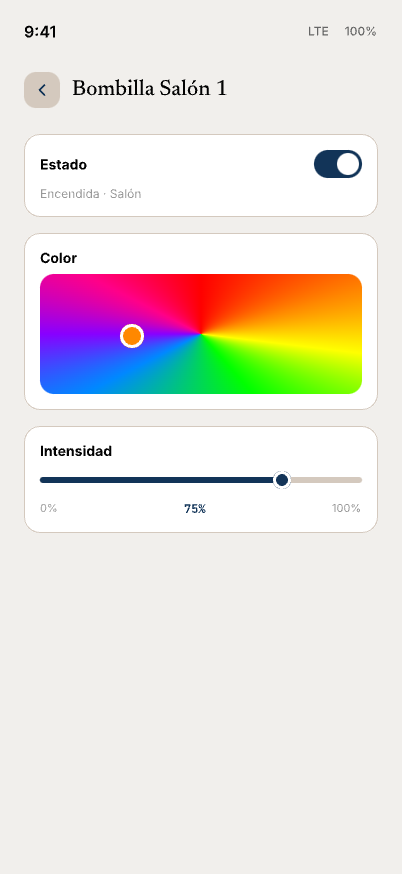

Control detallado de una bombilla inteligente. Incluye un toggle de encendido/apagado con indicación de su estado y ubicación, un selector de color que permite elegir el tono de la luz mediante un mapa cromático interactivo, y un slider de intensidad que permite ajustar el brillo entre el 0% y el 100%. Estos controles permiten personalizar completamente la iluminación de cada bombilla de forma individual.

---

## Detalle de Cerradura

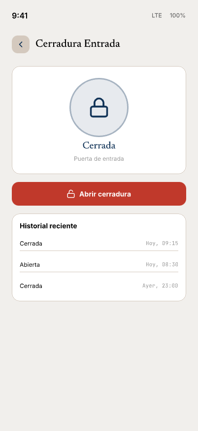

Pantalla de control de una cerradura inteligente. Muestra un indicador visual circular con el icono de candado y el estado actual (cerrada/abierta), junto con la ubicación del dispositivo. Un botón de acción permite abrir o cerrar la cerradura. En la parte inferior se presenta el historial reciente de actividad, registrando cada apertura y cierre con su marca temporal, lo que permite al usuario auditar el acceso a la puerta.

---

## Detalle de Persiana

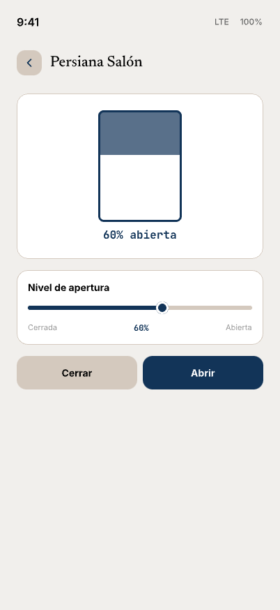

Control de una persiana inteligente con representación visual del nivel de apertura actual. Un gráfico muestra de forma intuitiva la proporción de la persiana que está abierta. Debajo, un slider permite ajustar con precisión el nivel de apertura entre completamente cerrada y completamente abierta, con indicación del porcentaje actual. Dos botones de acción rápida permiten cerrar o abrir completamente la persiana con un solo toque.

---

## Detalle de Termostato

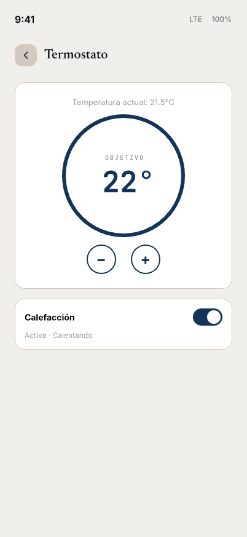

Pantalla de control del termostato del hogar. Muestra la temperatura actual medida por el sensor y, dentro de un dial circular, la temperatura objetivo configurada. Los botones de incremento y decremento permiten ajustar la temperatura deseada. Debajo, un toggle de calefacción indica si el sistema está activo y su estado operativo (calentando, en reposo, etc.). Esta pantalla proporciona un control completo del clima del hogar.

---

## Detalle de Smart TV

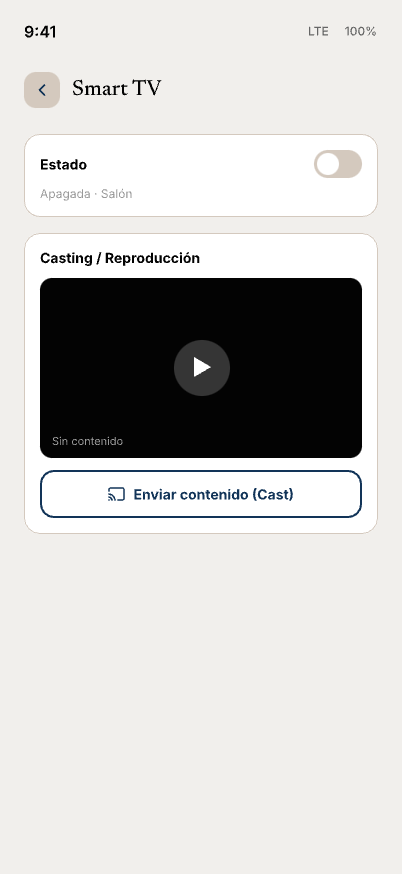

Control de la Smart TV con capacidad de casting. Incluye un toggle de encendido/apagado, una zona de previsualización del contenido en reproducción y un botón para enviar contenido mediante Chromecast. Esta pantalla también se utiliza desde el modo antiokupas para la reproducción automática de vídeos de YouTube como parte de la simulación de presencia.

---

## Interruptores

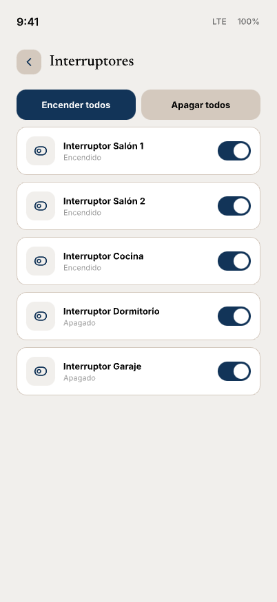

Vista de todos los interruptores inteligentes de la casa. Muestra los cinco interruptores con su nombre, ubicación y estado actual. Cada uno cuenta con un toggle individual. En la parte superior, dos botones de acción masiva permiten encender o apagar todos los interruptores de forma simultánea, facilitando el control rápido de múltiples dispositivos.

---

## Notificaciones y Eventos

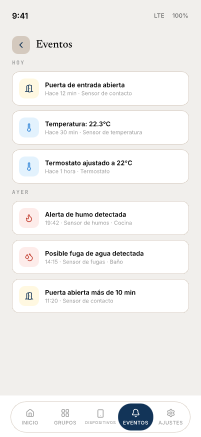

Historial de eventos y notificaciones generados por los sensores de la casa, organizados cronológicamente. Muestra alertas de diferentes tipos: avisos de puerta abierta del sensor de contacto, lecturas de temperatura, ajustes del termostato, alertas de humo y detección de fugas de agua. Cada evento incluye un icono representativo con código de color según la gravedad, una descripción del evento, el sensor que lo generó y la marca temporal. Las notificaciones se agrupan por día (Hoy, Ayer) para facilitar su consulta.

---

## Modo Antiokupas

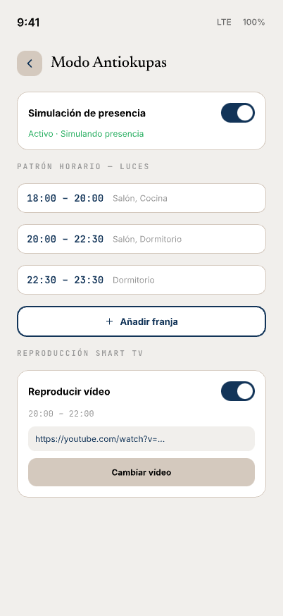

Configuración del modo de simulación de presencia. Permite activar o desactivar la simulación, que enciende luces y reproduce vídeo de forma automática según un patrón horario programado. La sección de luces muestra las franjas horarias configuradas, indicando las estancias donde se encenderán las luces en cada intervalo, con opción de añadir nuevas franjas. La sección de reproducción en Smart TV permite configurar el horario y la URL del vídeo de YouTube a reproducir. Todo ello simula que la casa está habitada cuando el usuario se encuentra ausente.

---

## Control por Voz

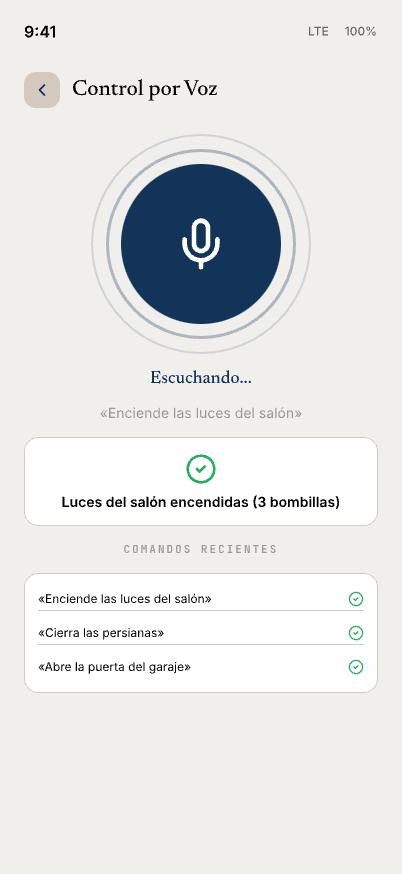

Interfaz de control por voz que permite actuar sobre los dispositivos mediante comandos hablados. Muestra un botón central de micrófono con indicador de estado de escucha, el comando reconocido por el sistema speech-to-text, y una tarjeta de confirmación con el resultado de la acción ejecutada. En la parte inferior se muestra un historial de comandos recientes con su estado de ejecución. Esta funcionalidad también está disponible desde el módulo Wear OS, que captura el audio y lo envía a la app principal para su procesamiento.

---

## Ajustes

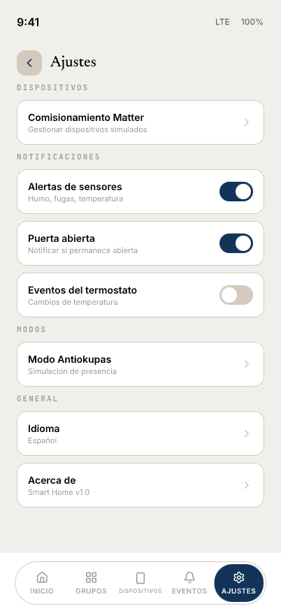

Pantalla de configuración general de la aplicación, organizada por secciones. La sección de dispositivos permite acceder al comisionamiento Matter para gestionar los dispositivos simulados. La sección de notificaciones ofrece toggles individuales para activar o desactivar las alertas de sensores (humo, fugas, temperatura), los avisos de puerta abierta y los eventos del termostato. La sección de modos da acceso directo a la configuración del modo antiokupas. Finalmente, la sección general incluye la selección de idioma (español/inglés) y la información de la aplicación.
